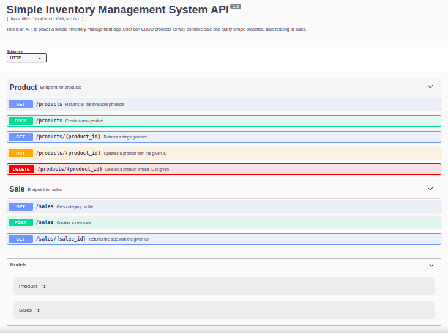

<h1 align="center">Inventory Management System API</h1>
<p>
  
  <a href="https://github.com/ebukaume/inventory-management-system-api#readme" target="_blank">
    
  </a>
  <a href="https://github.com/ebukaume/inventory-management-system-api/commit-activity" target="_blank">
    
  </a>
</p>

<br>

This is a simple inventory management API. A user can perform basic CRUD operations on the product resource. They can also create, show and delete sales.




## Table of Contents
3. <a href="#tech-stack-used">Tech Stack Used</a>
4. <a href="#application-features">Application Features</a>
5. <a href="#how-to-use">How To Use</a>
6. <a href="#author">Author</a>
6. <a href="#contributing">Contributing</a>
7. <a href="#license">License</a>


## Tech Stack Used

- [Node.js](https://nodejs.org/)
- [Express](https://expressjs.com/)
- [MongoDB](https://www.mongodb.com/what-is-mongodb)
- [Redis](https://redis.io/download)
- [Body-parser](https://www.npmjs.com/package/body-parser)
- [Babel](https://babeljs.io) 
- [Eslint](https://eslint.org/)
- [Swagger](https://swagger.io/)

## Application Features

A user can
*  add a product
*  view a product
*  view all products
*  update a product
*  delete a product
*  create a sale
*  view a sale
*  view all sales
*  view all sales in a given month
*  view all sales of a product in a given month


## How to Use

> Install [MongoDB](https://www.mongodb.com/what-is-mongodb) and [Redis](https://redis.io/download)

> Clone the repository to your local machine
```sh
$ git clone https://github.com/ebukaume/inventory-management-system-api.git
```

> Navigate into the project directory
```sh
$ cd inventory-management-system-api
```

> Set up environment variables
```sh
$ cp env.sample .env
# [NOTE]: Make sure to provide the necessary environment variables inside the .env file
```

> Fill in the environment variables. NB: `'NODE_ENV', 'PORT', 'API_PREFIX'` are *REQUIRED*

> Install the dependencies
```sh
$ npm install
```

> Start the server. _Make sure your mongoDB deamon and redis client are running_
```sh
$ npm start
```

> Then open your browser and visit `http://127.0.0.1:3000/api/v1/status`. You should see `{"status":"OK"}`. You can also use postman to issue the `GET` request to the status endpoint.

> You can access the API documentation by visiting `http://127.0.0.1:3000/api/v1/docs`

NB: 3000 is the default port when you don't supply a port in the .env; 127.0.0.1 is the default host as well.


## Author

👤 **Ebuka UMEOKONKWO**

- Github: [@ebukaume](https://github.com/ebukaume)
- Twitter: [@ebukaume](https://twitter.com/ebukaume)
- Linkedin: [Ebuka Umeokonkwo](https://www.linkedin.com/in/ebukaume)


## 🤝 Contributing

Contributions, issues and feature requests are welcome!<br />Feel free to check [issues page](https://github.com/ebukaume/inventory-management-system-api/issues).

1. Fork it (https://github.com/ebukaume/inventory-management-system-api.git/fork)
2. Create your working branch (git checkout -b [choose-a-name])
3. Commit your changes (git commit -am 'what this commit will fix/add/improve')
4. Push to the branch (git push origin [chosen-name])
5. Create a new Pull Request


## Show your support

Give a ⭐️ if you like this project!
